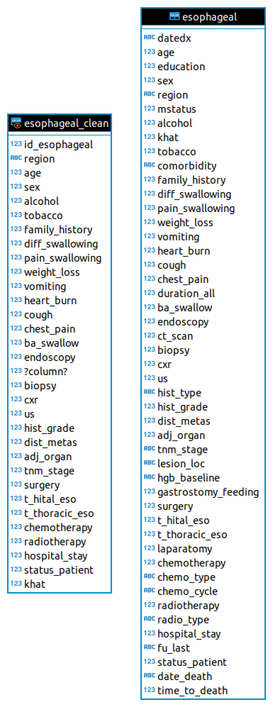

# Seminario de Herramientas para Ciencia de Datos
## :rocket: Proyecto: Patrones de Supervivencia para Distintos tipos de Cáncer
**Maestría en Ciencia e Ingeniería de la Computación, UNAM**   
*Manuel Soto Romero*   

:warning: *Borrador. Trabajo en proceso.*

### :capital_abcd: Introducción
Este proyecto está basado en el reto *Survival Patterns of Cancers* disponible en la plataforma [Kaggle](https://www.kaggle.com/saurabhshahane/survival-patterns-of-cancers).
Este proyecto incluye tres conjuntos de datos:

- Datos sobre cancer de esófago.
- Datos sobre cancer colorectal.
- Datos sobre cancer de próstata.

cada uno de los cuales incluye información sociodemográfica, características de los pacientes, signos, síntomas, 
características de imagen e histológicas así como el estudio [TNM](https://en.wikipedia.org/wiki/TNM_staging_system) del 
cáncer. Así mismo incluye opciones de tratamiento que recibió el paciente así como el estado del mismo (si falleció o
no).

#### :dart: Objetivos y Tareas

- Cargar los datos en un modelo de base de datos relacional.

- Realizar un análisis exploratorio de dato con el fin de obtener estadísticas sobre los datos obtenidos.

- Conectar la base de datos con __Python__ sobre su herramienta __Jupyter Notebooks__ para realizar labores de 
  predicción, clasificación, entre otras posibles.

- Con base en el campo que nos permite determinar si el paciente sobrevivió o no, determinar la correlación de variables
  que nos permita realizar un modelo de predicción quizá por medio de *regresión*.

- Con base en el campo de tratamiento y el campo que determina si el paciente sobrevivió, realizar un modelo de 
  clasificación que ayude a determinar el mejor tratamiento para nuevos pacientes. (:warning: Quizá sea más conveniente
  tratarlo como problema de decisión o de recomendación).

- Por supuesto, realizar actividades de preprocesamiento de los datos con el fin de tener un conjunto de datos limpio
  y bien estructurado que facilite las tareas de predicción y/o clasificación.

### :ballot_box_with_check: Carga y preprocesamiento de datos

Se obtó por usar el Gestor de Bases de Datos __PostgreSQL__ pues sus cláusulas `CUBE` y `ROLLUP` nos permiten realizar
un análisis exploratorio más detallado. Se contó inicialmente con los siguientes conjuntos de datos:

- [colorectal.csv](datasets/colorectal.csv)
- [esophageal.csv](datasets/esophageal.csv)
- [prostate.csv](datasets/postate.csv)

Previo a la carga de datos, se analizó la estructura de cada archivo para determinar si era necesario crear nuevas 
tablas. Derivado de este análisis se notó que no había una equivalencia directa entre estas tablas, por lo que se optó analizar cada conjunto de datos individualmente, sin embargo, **para los fines de este proyecto únicamente se analizaron los datos de cáncer de esófago**.

No se ocuparon todos los datos pues no eran relevantes para el proyecto. Con el fin de no perder los datos originales, se creó una vista (`esophageal_clean`). Las diferencias entre la tabla original y la vista se muestran en el siguiente diagrama:

Notar el cambio en los tipos de datos. El proceso de cambio y la construcción de la vista se puede consultar en el siguiente [*script*](limpieza/esophageal.sql) y puede replicarse para los otros dos conjuntos de datos, cuidando que las columnas sean del tipo adecuado y evitando los valores nulos.

### :o: Análisis Exploratorio de Datos

Se dividió el Análisis Exploratorio de Datos en tres partes (1) Análisis de algunos campos y de interés por medio de SQL mediante sus cláusulas (`GROUP BY`, `CUBE`, `ROLLUP`, funciones de ventana); (2) Análisis mediante medidas de tendencia central para cada uno de los campos y medidas de variabilidad; (3) Análisis visual mediante histogramas y gráficas de barras para determinar la forma de los datos.

<strong>1. Análisis por medio de SQL (<em><a href="analisis_exploratorio/eda.sql">script</a>)</em></strong> 

	

- Conteo de registros.

	Name |Value|
	-----|-----|
	count|349  |

- ¿Cuál es la edad promedio por región?

	region     |avg_age|
	-----------|-------|
	DIREDAWA   |  45.50|
	HARERI     |  60.00|
	AFAR       |  47.67|
	GAMBELLA   |  42.00|
	AMHARA     |  50.23|
	SOMALI     |  37.00|
	ADDIS ABABA|  54.61|
	TIGRAY     |  57.75|
	SNNPR      |  47.54|
	OROMIA     |  52.11|

- ¿Cuál es la edad promedio por región y género?

	region     |sex|avg_age|
	-----------|---|-------|
	ADDIS ABABA|  1|  54.08|
	ADDIS ABABA|  0|  55.03|
	AFAR       |  1|  30.00|
	AFAR       |  0|  56.50|
	AMHARA     |  0|  48.50|
	AMHARA     |  1|  54.13|
	DIREDAWA   |  1|  45.50|
	GAMBELLA   |  0|  42.00|
	HARERI     |  1|  60.00|
	HARERI     |  0|  60.00|
	OROMIA     |  0|  50.57|
	OROMIA     |  1|  54.39|
	SNNPR      |  0|  46.90|
	SNNPR      |  1|  48.39|
	SOMALI     |  1|  36.67|
	SOMALI     |  0|  37.50|
	TIGRAY     |  1|  55.00|
	TIGRAY     |  0|  58.67|

- Calculamos todos los agrupamientos posibles por medio de `CUBE`.

	region     |sex|avg_age|
	-----------|---|-------|
	ADDIS ABABA|  NULL |  54.61|
	ADDIS ABABA|  1|  54.08|
	ADDIS ABABA|  0|  55.03|
	AFAR       |  NULL |  47.67|
	AFAR       |  0|  56.50|
	AFAR       |  1|  30.00|
	AMHARA     |  1|  54.13|
	AMHARA     |  NULL |  50.23|
	AMHARA     |  0|  48.50|
	DIREDAWA   |  NULL |  45.50|
	DIREDAWA   |  1|  45.50|
	GAMBELLA   |  0|  42.00|
	GAMBELLA   |  NULL |  42.00|
	HARERI     |  NULL |  60.00|
	HARERI     |  0|  60.00|
	HARERI     |  1|  60.00|
	OROMIA     |  NULL |  52.11|
	OROMIA     |  1|  54.39|
	OROMIA     |  0|  50.57|
	SNNPR      |  NULL |  47.54|
	SNNPR      |  1|  48.39|
	SNNPR      |  0|  46.90|
	SOMALI     |  1|  36.67|
	SOMALI     |  NULL |  37.00|
	SOMALI     |  0|  37.50|
	TIGRAY     |  NULL |  57.75|
	TIGRAY     |  0|  58.67|
	TIGRAY     |  1|  55.00|
	NULL       |  1|  52.73|
	NULL       |  0|  50.54|
	NULL       |  NULL |  51.44|

	Con esta información podemos concluir:

	- La edad promedio en ADDIS ABABA (todos los géneros) es 54.61 (renglón 1)
	- La edad promedio del género 0 es 50.54 (penúltimo renglón)
	- La edad promedio de todos los registrios (todas las regiones y géneros) es 51.44

- Para asegurarnos de que los nullos correspondan con *ALL* usamos `grouping`.

	region     |sex|gr|gs|avg_age|
	-----------|---|--|--|-------|
	ADDIS ABABA|  NULL | 0| 1|  54.61|
	ADDIS ABABA|  1| 0| 0|  54.08|
	ADDIS ABABA|  0| 0| 0|  55.03|
	AFAR       |  NULL | 0| 1|  47.67|
	AFAR       |  0| 0| 0|  56.50|
	AFAR       |  1| 0| 0|  30.00|
	AMHARA     |  1| 0| 0|  54.13|
	AMHARA     |  NULL | 0| 1|  50.23|
	AMHARA     |  0| 0| 0|  48.50|
	DIREDAWA   |  NULL | 0| 1|  45.50|
	DIREDAWA   |  1| 0| 0|  45.50|
	GAMBELLA   |  0| 0| 0|  42.00|
	GAMBELLA   |  NULL | 0| 1|  42.00|
	HARERI     |  NULL | 0| 1|  60.00|
	HARERI     |  0| 0| 0|  60.00|
	HARERI     |  1| 0| 0|  60.00|
	OROMIA     |  NULL | 0| 1|  52.11|
	OROMIA     |  1| 0| 0|  54.39|
	OROMIA     |  0| 0| 0|  50.57|
	SNNPR      |  NULL | 0| 1|  47.54|
	SNNPR      |  1| 0| 0|  48.39|
	SNNPR      |  0| 0| 0|  46.90|
	SOMALI     |  1| 0| 0|  36.67|
	SOMALI     |  NULL | 0| 1|  37.00|
	SOMALI     |  0| 0| 0|  37.50|
	TIGRAY     |  NULL | 0| 1|  57.75|
	TIGRAY     |  0| 0| 0|  58.67|
	TIGRAY     |  1| 0| 0|  55.00|
	NULL       |  1| 1| 0|  52.73|
	NULL       |  0| 1| 0|  50.54|
	NULL       |  NULL | 1| 1|  51.44|

	Con el resultado anterior comprobamos que todos los `NULL` corresponden con *ALL*.

- De manera similar usamos `ROLLUP` a manera de mostrar las posibles combinaciones en jerarquía, es decir, se obtienen los totales por género en términos de la región. Notar como la última columna no muestra el total de totales ni el total por región.

	region     |sex|gr|gs|avg_age|
	-----------|---|--|--|-------|
	ADDIS ABABA|  NULL | 0| 1|  54.61|
	ADDIS ABABA|  1| 0| 0|  54.08|
	ADDIS ABABA|  0| 0| 0|  55.03|
	AFAR       |  NULL | 0| 1|  47.67|
	AFAR       |  0| 0| 0|  56.50|
	AFAR       |  1| 0| 0|  30.00|
	AMHARA     |  1| 0| 0|  54.13|
	AMHARA     |  NULL | 0| 1|  50.23|
	AMHARA     |  0| 0| 0|  48.50|
	DIREDAWA   |  NULL | 0| 1|  45.50|
	DIREDAWA   |  1| 0| 0|  45.50|
	GAMBELLA   |  0| 0| 0|  42.00|
	GAMBELLA   |  NULL | 0| 1|  42.00|
	HARERI     |  NULL | 0| 1|  60.00|
	HARERI     |  0| 0| 0|  60.00|
	HARERI     |  1| 0| 0|  60.00|
	OROMIA     |  NULL | 0| 1|  52.11|
	OROMIA     |  1| 0| 0|  54.39|
	OROMIA     |  0| 0| 0|  50.57|
	SNNPR      |  0| 0| 0|  46.90|
	SNNPR      |  NULL | 0| 1|  47.54|
	SNNPR      |  1| 0| 0|  48.39|
	SOMALI     |  0| 0| 0|  37.50|
	SOMALI     |  1| 0| 0|  36.67|
	SOMALI     |  NULL | 0| 1|  37.00|
	TIGRAY     |  0| 0| 0|  58.67|
	TIGRAY     |  1| 0| 0|  55.00|
	TIGRAY     |  NULL | 0| 1|  57.75|
	NULL       |  NULL | 1| 1|  51.44|

- `OVER` es una función analítica que opera por cada tupla. En este caso compararemos la de cada persona con la edad promedio de cada género. Recordando que el análisis es pon renglón. Por ejemplo, el renglón 1 tiene un promedio de 71 y se compara con el promedio general de 50.54.

	region     |sex|age|avg_age|
	-----------|---|---|-------|
	OROMIA     |  0| 71|  50.54|
	AMHARA     |  0| 70|  50.54|
	OROMIA     |  0| 46|  50.54|
	ADDIS ABABA|  1| 55|  52.73|
	SNNPR      |  0| 32|  50.54|
	ADDIS ABABA|  1| 56|  52.73|
	ADDIS ABABA|  0| 60|  50.54|
	TIGRAY     |  1| 55|  52.73|
	ADDIS ABABA|  1| 63|  52.73|
	ADDIS ABABA|  1| 74|  52.73|
	AFAR       |  1| 30|  52.73|
	GAMBELLA   |  0| 42|  50.54|
	OROMIA     |  1| 47|  52.73|
	DIREDAWA   |  1| 56|  52.73|
	ADDIS ABABA|  0| 32|  50.54|
	AMHARA     |  0| 48|  50.54|
	ADDIS ABABA|  0| 30|  50.54|
	SNNPR      |  1| 62|  52.73|
	OROMIA     |  1| 52|  52.73|
	OROMIA     |  0| 52|  50.54|
	OROMIA     |  0| 44|  50.54|
	SNNPR      |  0| 55|  50.54|
	SNNPR      |  0| 48|  50.54|
	AMHARA     |  0| 35|  50.54|
	SNNPR      |  1| 60|  52.73|
	SNNPR      |  0| 36|  50.54|
	ADDIS ABABA|  0| 35|  50.54|
	ADDIS ABABA|  1| 67|  52.73|
	SNNPR      |  0| 40|  50.54|
	ADDIS ABABA|  0| 71|  50.54|
	OROMIA     |  0| 25|  50.54|
	OROMIA     |  0| 58|  50.54|
	ADDIS ABABA|  1| 60|  52.73|
	ADDIS ABABA|  1| 70|  52.73|
	OROMIA     |  1| 50|  52.73|
	OROMIA     |  0| 27|  50.54|
	SNNPR      |  0| 45|  50.54|
	OROMIA     |  1| 55|  52.73|
	SNNPR      |  1| 50|  52.73|
	OROMIA     |  1| 58|  52.73|
	AMHARA     |  0| 57|  50.54|
	AMHARA     |  0| 55|  50.54|
	ADDIS ABABA|  0| 48|  50.54|
	ADDIS ABABA|  0| 65|  50.54|
	OROMIA     |  1| 80|  52.73|
	OROMIA     |  1| 48|  52.73|
	OROMIA     |  0| 56|  50.54|
	OROMIA     |  1| 40|  52.73|
	OROMIA     |  1| 75|  52.73|
	AMHARA     |  1| 60|  52.73|
	SNNPR      |  1| 30|  52.73|
	OROMIA     |  1| 45|  52.73|
	OROMIA     |  0| 55|  50.54|
	OROMIA     |  0| 48|  50.54|
	AMHARA     |  0| 50|  50.54|
	OROMIA     |  0| 50|  50.54|
	SNNPR      |  0| 27|  50.54|
	OROMIA     |  1| 27|  52.73|
	ADDIS ABABA|  0| 45|  50.54|
	OROMIA     |  1| 54|  52.73|
	OROMIA     |  1| 64|  52.73|
	OROMIA     |  1| 46|  52.73|
	ADDIS ABABA|  1| 53|  52.73|
	AFAR       |  0| 48|  50.54|
	SNNPR      |  1| 36|  52.73|
	AMHARA     |  0| 58|  50.54|
	OROMIA     |  1| 70|  52.73|
	OROMIA     |  1| 77|  52.73|
	SOMALI     |  0| 25|  50.54|
	ADDIS ABABA|  0| 56|  50.54|
	ADDIS ABABA|  1| 49|  52.73|
	ADDIS ABABA|  1| 65|  52.73|
	OROMIA     |  1| 62|  52.73|
	OROMIA     |  0| 49|  50.54|
	OROMIA     |  1| 30|  52.73|
	OROMIA     |  1| 59|  52.73|
	ADDIS ABABA|  1| 40|  52.73|
	AMHARA     |  0| 34|  50.54|
	OROMIA     |  0| 40|  50.54|
	ADDIS ABABA|  1| 27|  52.73|
	ADDIS ABABA|  0| 70|  50.54|
	SNNPR      |  0| 42|  50.54|
	OROMIA     |  0| 66|  50.54|
	OROMIA     |  1| 38|  52.73|
	AMHARA     |  1| 53|  52.73|
	AMHARA     |  1| 44|  52.73|
	SNNPR      |  0| 60|  50.54|
	SNNPR      |  0| 52|  50.54|
	SNNPR      |  1| 70|  52.73|
	AMHARA     |  0| 52|  50.54|
	OROMIA     |  0| 60|  50.54|
	ADDIS ABABA|  0| 80|  50.54|
	ADDIS ABABA|  0| 50|  50.54|
	AMHARA     |  1| 65|  52.73|
	ADDIS ABABA|  1| 26|  52.73|
	OROMIA     |  1| 95|  52.73|
	AMHARA     |  0| 40|  50.54|
	HARERI     |  0| 60|  50.54|
	ADDIS ABABA|  0| 36|  50.54|
	DIREDAWA   |  1| 35|  52.73|
	OROMIA     |  1| 42|  52.73|
	ADDIS ABABA|  1| 50|  52.73|
	OROMIA     |  1| 60|  52.73|
	OROMIA     |  0| 38|  50.54|
	OROMIA     |  1| 56|  52.73|
	OROMIA     |  0| 75|  50.54|
	TIGRAY     |  0| 65|  50.54|
	OROMIA     |  0| 65|  50.54|
	AMHARA     |  1| 47|  52.73|
	AMHARA     |  1| 63|  52.73|
	OROMIA     |  0| 45|  50.54|
	ADDIS ABABA|  1| 73|  52.73|
	TIGRAY     |  0| 56|  50.54|
	ADDIS ABABA|  1| 42|  52.73|
	ADDIS ABABA|  0| 43|  50.54|
	SNNPR      |  1| 20|  52.73|
	SNNPR      |  0| 50|  50.54|
	OROMIA     |  1| 67|  52.73|
	SNNPR      |  1| 18|  52.73|
	AFAR       |  0| 65|  50.54|
	SNNPR      |  0| 65|  50.54|
	OROMIA     |  1| 63|  52.73|
	SNNPR      |  1| 40|  52.73|
	SNNPR      |  1| 35|  52.73|
	ADDIS ABABA|  0| 53|  50.54|
	SOMALI     |  1| 22|  52.73|
	ADDIS ABABA|  1| 45|  52.73|
	OROMIA     |  1| 43|  52.73|
	OROMIA     |  1| 57|  52.73|
	SNNPR      |  0| 25|  50.54|
	SNNPR      |  1| 63|  52.73|
	ADDIS ABABA|  0| 52|  50.54|
	ADDIS ABABA|  1| 58|  52.73|
	OROMIA     |  0| 35|  50.54|
	AMHARA     |  1| 58|  52.73|
	SNNPR      |  0| 53|  50.54|
	OROMIA     |  1| 35|  52.73|
	SOMALI     |  0| 50|  50.54|
	ADDIS ABABA|  0| 66|  50.54|
	TIGRAY     |  0| 55|  50.54|
	ADDIS ABABA|  1| 66|  52.73|
	AMHARA     |  0| 41|  50.54|
	SNNPR      |  1| 45|  52.73|
	OROMIA     |  0| 68|  50.54|
	SOMALI     |  1| 40|  52.73|
	ADDIS ABABA|  1| 62|  52.73|
	SNNPR      |  1| 59|  52.73|
	AMHARA     |  1| 43|  52.73|
	OROMIA     |  0| 42|  50.54|
	SNNPR      |  0| 54|  50.54|
	OROMIA     |  0| 30|  50.54|
	OROMIA     |  0| 54|  50.54|
	ADDIS ABABA|  0| 75|  50.54|
	ADDIS ABABA|  1| 32|  52.73|
	AMHARA     |  0| 60|  50.54|
	OROMIA     |  0| 57|  50.54|
	OROMIA     |  1| 65|  52.73|
	SOMALI     |  1| 48|  52.73|
	HARERI     |  1| 60|  52.73|
	ADDIS ABABA|  0| 55|  50.54|
	OROMIA     |  0| 43|  50.54|
	OROMIA     |  0| 70|  50.54|
	OROMIA     |  0| 32|  50.54|
	ADDIS ABABA|  0| 62|  50.54|
	AMHARA     |  0| 53|  50.54|

### :o: Predicción

*Sección en proceso*

### :o: Clasificación

*Sección en proceso*

### :o: Resultados

*Sección en proceso*

### :o: Conclusiones

*Sección en proceso*

### :o: Trabajo a futuro

*Sección en proceso*
