# Seminario de Herramientas para Ciencia de Datos
## :rocket: Proyecto: Patrones de Supervivencia para Distintos tipos de Cáncer
**Maestría en Ciencia e Ingeniería de la Computación, UNAM**   
*Manuel Soto Romero*   


---

### :capital_abcd: Introducción
Este proyecto está basado en el reto *Survival Patterns of Cancers* disponible en la plataforma [Kaggle](https://www.kaggle.com/saurabhshahane/survival-patterns-of-cancers).
Este proyecto incluye tres conjuntos de datos:

- Datos sobre cancer de esófago.
- Datos sobre cancer colorectal.
- Datos sobre cancer de próstata.

cada uno de los cuales incluye información sociodemográfica, características de los pacientes, signos, síntomas, 
características de imagen e histológicas así como el estudio [TNM](https://en.wikipedia.org/wiki/TNM_staging_system) del 
cáncer. Así mismo incluye opciones de tratamiento que recibió el paciente así como el estado del mismo (si falleció o
no).

#### :dart: Objetivos y Tareas

- Cargar los datos en un modelo de base de datos relacional.

- Realizar un análisis exploratorio de dato con el fin de obtener estadísticas sobre los datos obtenidos.

- Conectar la base de datos con __Python__ sobre su herramienta __Jupyter Notebooks__ para realizar labores de 
  predicción, clasificación, entre otras posibles.

- Con base en el campo que nos permite determinar si el paciente sobrevivió o no, evaluar distintos tipos de modelos de regresión y clasificación con el fin de encontrar el mejor posible para predecir este dato con nuevos pacientes.

- Por supuesto, realizar actividades de preprocesamiento de los datos con el fin de tener un conjunto de datos limpio
  y bien estructurado que facilite las tareas de predicción y/o clasificación.

---

### :ballot_box_with_check: Carga y preprocesamiento de datos

Se obtó por usar el Gestor de Bases de Datos __PostgreSQL__ pues sus cláusulas `CUBE` y `ROLLUP` nos permiten realizar
un análisis exploratorio más detallado. Se contó inicialmente con los siguientes conjuntos de datos:

- [colorectal.csv](datasets/colorectal.csv)
- [esophageal.csv](datasets/esophageal.csv)
- [prostate.csv](datasets/postate.csv)

Previo a la carga de datos, se analizó la estructura de cada archivo para determinar si era necesario crear nuevas 
tablas. Derivado de este análisis se notó que no había una equivalencia directa entre estas tablas, por lo que se optó analizar cada conjunto de datos individualmente, sin embargo, **para los fines de este proyecto únicamente se analizaron los datos de cáncer de esófago**.

No se ocuparon todos los datos pues no eran relevantes para el proyecto. Con el fin de no perder los datos originales, se creó una vista (`esophageal_clean`). Las diferencias entre la tabla original y la vista se muestran en el siguiente diagrama:

<center></center>

Notar el cambio en los tipos de datos. El proceso de cambio y la construcción de la vista se puede consultar en el siguiente [*script*](limpieza/esophageal.sql) y puede replicarse para los otros dos conjuntos de datos, cuidando que las columnas sean del tipo adecuado y evitando los valores nulos.

---

### :ballot_box_with_check: Análisis Exploratorio de Datos

Se dividió el Análisis Exploratorio de Datos en tres partes (1) Análisis de algunos campos y de interés por medio de SQL mediante sus cláusulas (`GROUP BY`, `CUBE`, `ROLLUP`, funciones de ventana); (2) Análisis mediante medidas de tendencia central para algunos de los campos y medidas de variabilidad; (3) Análisis visual.

<details><summary><strong>Análisis por medio de SQL (<em><a href="analisis_exploratorio/eda.sql">script</a>)</em></strong> </summary>
	<p>

- Conteo de registros.

	Name |Value|
	-----|-----|
	count|349  |

- ¿Cuál es la edad promedio por región?

	region     |avg_age|
	-----------|-------|
	DIREDAWA   |  45.50|
	HARERI     |  60.00|
	AFAR       |  47.67|
	GAMBELLA   |  42.00|
	AMHARA     |  50.23|
	SOMALI     |  37.00|
	ADDIS ABABA|  54.61|
	TIGRAY     |  57.75|
	SNNPR      |  47.54|
	OROMIA     |  52.11|

- ¿Cuál es la edad promedio por región y género?

	region     |sex|avg_age|
	-----------|---|-------|
	ADDIS ABABA|  1|  54.08|
	ADDIS ABABA|  0|  55.03|
	AFAR       |  1|  30.00|
	AFAR       |  0|  56.50|
	AMHARA     |  0|  48.50|
	AMHARA     |  1|  54.13|
	DIREDAWA   |  1|  45.50|
	GAMBELLA   |  0|  42.00|
	HARERI     |  1|  60.00|
	HARERI     |  0|  60.00|
	OROMIA     |  0|  50.57|
	OROMIA     |  1|  54.39|
	SNNPR      |  0|  46.90|
	SNNPR      |  1|  48.39|
	SOMALI     |  1|  36.67|
	SOMALI     |  0|  37.50|
	TIGRAY     |  1|  55.00|
	TIGRAY     |  0|  58.67|

- Calculamos todos los agrupamientos posibles por medio de `CUBE`.

	region     |sex|avg_age|
	-----------|---|-------|
	ADDIS ABABA|  NULL |  54.61|
	ADDIS ABABA|  1|  54.08|
	ADDIS ABABA|  0|  55.03|
	AFAR       |  NULL |  47.67|
	AFAR       |  0|  56.50|
	AFAR       |  1|  30.00|
	AMHARA     |  1|  54.13|
	AMHARA     |  NULL |  50.23|
	AMHARA     |  0|  48.50|
	DIREDAWA   |  NULL |  45.50|
	DIREDAWA   |  1|  45.50|
	GAMBELLA   |  0|  42.00|
	GAMBELLA   |  NULL |  42.00|
	HARERI     |  NULL |  60.00|
	HARERI     |  0|  60.00|
	HARERI     |  1|  60.00|
	OROMIA     |  NULL |  52.11|
	OROMIA     |  1|  54.39|
	OROMIA     |  0|  50.57|
	SNNPR      |  NULL |  47.54|
	SNNPR      |  1|  48.39|
	SNNPR      |  0|  46.90|
	SOMALI     |  1|  36.67|
	SOMALI     |  NULL |  37.00|
	SOMALI     |  0|  37.50|
	TIGRAY     |  NULL |  57.75|
	TIGRAY     |  0|  58.67|
	TIGRAY     |  1|  55.00|
	NULL       |  1|  52.73|
	NULL       |  0|  50.54|
	NULL       |  NULL |  51.44|

	Con esta información podemos concluir:

	- La edad promedio en ADDIS ABABA (todos los géneros) es 54.61 (renglón 1)
	- La edad promedio del género 0 es 50.54 (penúltimo renglón)
	- La edad promedio de todos los registrios (todas las regiones y géneros) es 51.44

- Para asegurarnos de que los nullos correspondan con *ALL* usamos `grouping`.

	region     |sex|gr|gs|avg_age|
	-----------|---|--|--|-------|
	ADDIS ABABA|  NULL | 0| 1|  54.61|
	ADDIS ABABA|  1| 0| 0|  54.08|
	ADDIS ABABA|  0| 0| 0|  55.03|
	AFAR       |  NULL | 0| 1|  47.67|
	AFAR       |  0| 0| 0|  56.50|
	AFAR       |  1| 0| 0|  30.00|
	AMHARA     |  1| 0| 0|  54.13|
	AMHARA     |  NULL | 0| 1|  50.23|
	AMHARA     |  0| 0| 0|  48.50|
	DIREDAWA   |  NULL | 0| 1|  45.50|
	DIREDAWA   |  1| 0| 0|  45.50|
	GAMBELLA   |  0| 0| 0|  42.00|
	GAMBELLA   |  NULL | 0| 1|  42.00|
	HARERI     |  NULL | 0| 1|  60.00|
	HARERI     |  0| 0| 0|  60.00|
	HARERI     |  1| 0| 0|  60.00|
	OROMIA     |  NULL | 0| 1|  52.11|
	OROMIA     |  1| 0| 0|  54.39|
	OROMIA     |  0| 0| 0|  50.57|
	SNNPR      |  NULL | 0| 1|  47.54|
	SNNPR      |  1| 0| 0|  48.39|
	SNNPR      |  0| 0| 0|  46.90|
	SOMALI     |  1| 0| 0|  36.67|
	SOMALI     |  NULL | 0| 1|  37.00|
	SOMALI     |  0| 0| 0|  37.50|
	TIGRAY     |  NULL | 0| 1|  57.75|
	TIGRAY     |  0| 0| 0|  58.67|
	TIGRAY     |  1| 0| 0|  55.00|
	NULL       |  1| 1| 0|  52.73|
	NULL       |  0| 1| 0|  50.54|
	NULL       |  NULL | 1| 1|  51.44|

	Con el resultado anterior comprobamos que todos los `NULL` corresponden con *ALL*.

- De manera similar usamos `ROLLUP` a manera de mostrar las posibles combinaciones en jerarquía, es decir, se obtienen los totales por género en términos de la región. Notar como la última columna no muestra el total de totales ni el total por región.

	region     |sex|gr|gs|avg_age|
	-----------|---|--|--|-------|
	ADDIS ABABA|  NULL | 0| 1|  54.61|
	ADDIS ABABA|  1| 0| 0|  54.08|
	ADDIS ABABA|  0| 0| 0|  55.03|
	AFAR       |  NULL | 0| 1|  47.67|
	AFAR       |  0| 0| 0|  56.50|
	AFAR       |  1| 0| 0|  30.00|
	AMHARA     |  1| 0| 0|  54.13|
	AMHARA     |  NULL | 0| 1|  50.23|
	AMHARA     |  0| 0| 0|  48.50|
	DIREDAWA   |  NULL | 0| 1|  45.50|
	DIREDAWA   |  1| 0| 0|  45.50|
	GAMBELLA   |  0| 0| 0|  42.00|
	GAMBELLA   |  NULL | 0| 1|  42.00|
	HARERI     |  NULL | 0| 1|  60.00|
	HARERI     |  0| 0| 0|  60.00|
	HARERI     |  1| 0| 0|  60.00|
	OROMIA     |  NULL | 0| 1|  52.11|
	OROMIA     |  1| 0| 0|  54.39|
	OROMIA     |  0| 0| 0|  50.57|
	SNNPR      |  0| 0| 0|  46.90|
	SNNPR      |  NULL | 0| 1|  47.54|
	SNNPR      |  1| 0| 0|  48.39|
	SOMALI     |  0| 0| 0|  37.50|
	SOMALI     |  1| 0| 0|  36.67|
	SOMALI     |  NULL | 0| 1|  37.00|
	TIGRAY     |  0| 0| 0|  58.67|
	TIGRAY     |  1| 0| 0|  55.00|
	TIGRAY     |  NULL | 0| 1|  57.75|
	NULL       |  NULL | 1| 1|  51.44|

- `OVER` es una función analítica que opera por cada tupla. En este caso compararemos la de cada persona con la edad promedio de cada género. Recordando que el análisis es pon renglón. Por ejemplo, el renglón 1 tiene un promedio de 71 y se compara con el promedio general de 50.54.

	region     |sex|age|avg_age|
	-----------|---|---|-------|
	OROMIA     |  0| 71|  50.54|
	AMHARA     |  0| 70|  50.54|
	OROMIA     |  0| 46|  50.54|
	ADDIS ABABA|  1| 55|  52.73|
	SNNPR      |  0| 32|  50.54|
	ADDIS ABABA|  1| 56|  52.73|
	ADDIS ABABA|  0| 60|  50.54|
	TIGRAY     |  1| 55|  52.73|
	ADDIS ABABA|  1| 63|  52.73|
	ADDIS ABABA|  1| 74|  52.73|
	AFAR       |  1| 30|  52.73|
	GAMBELLA   |  0| 42|  50.54|
	OROMIA     |  1| 47|  52.73|
	DIREDAWA   |  1| 56|  52.73|
	ADDIS ABABA|  0| 32|  50.54|
	AMHARA     |  0| 48|  50.54|
	ADDIS ABABA|  0| 30|  50.54|
	SNNPR      |  1| 62|  52.73|
	OROMIA     |  1| 52|  52.73|
	OROMIA     |  0| 52|  50.54|
	OROMIA     |  0| 44|  50.54|
	SNNPR      |  0| 55|  50.54|
	SNNPR      |  0| 48|  50.54|
	AMHARA     |  0| 35|  50.54|
	SNNPR      |  1| 60|  52.73|
	SNNPR      |  0| 36|  50.54|
	ADDIS ABABA|  0| 35|  50.54|
	ADDIS ABABA|  1| 67|  52.73|
	SNNPR      |  0| 40|  50.54|
	ADDIS ABABA|  0| 71|  50.54|
	OROMIA     |  0| 25|  50.54|
	OROMIA     |  0| 58|  50.54|
	ADDIS ABABA|  1| 60|  52.73|
	ADDIS ABABA|  1| 70|  52.73|
	OROMIA     |  1| 50|  52.73|
	OROMIA     |  0| 27|  50.54|
	SNNPR      |  0| 45|  50.54|
	OROMIA     |  1| 55|  52.73|
	SNNPR      |  1| 50|  52.73|
	OROMIA     |  1| 58|  52.73|
	AMHARA     |  0| 57|  50.54|
	AMHARA     |  0| 55|  50.54|
	ADDIS ABABA|  0| 48|  50.54|
	ADDIS ABABA|  0| 65|  50.54|
	OROMIA     |  1| 80|  52.73|
	OROMIA     |  1| 48|  52.73|
	OROMIA     |  0| 56|  50.54|
	OROMIA     |  1| 40|  52.73|
	OROMIA     |  1| 75|  52.73|
	AMHARA     |  1| 60|  52.73|
	SNNPR      |  1| 30|  52.73|
	OROMIA     |  1| 45|  52.73|
	OROMIA     |  0| 55|  50.54|
	OROMIA     |  0| 48|  50.54|
	AMHARA     |  0| 50|  50.54|
	OROMIA     |  0| 50|  50.54|
	SNNPR      |  0| 27|  50.54|
	OROMIA     |  1| 27|  52.73|
	ADDIS ABABA|  0| 45|  50.54|
	OROMIA     |  1| 54|  52.73|
	OROMIA     |  1| 64|  52.73|
	OROMIA     |  1| 46|  52.73|
	ADDIS ABABA|  1| 53|  52.73|
	AFAR       |  0| 48|  50.54|
	SNNPR      |  1| 36|  52.73|
	AMHARA     |  0| 58|  50.54|
	OROMIA     |  1| 70|  52.73|
	OROMIA     |  1| 77|  52.73|
	SOMALI     |  0| 25|  50.54|
	ADDIS ABABA|  0| 56|  50.54|
	ADDIS ABABA|  1| 49|  52.73|
	ADDIS ABABA|  1| 65|  52.73|
	OROMIA     |  1| 62|  52.73|
	OROMIA     |  0| 49|  50.54|
	OROMIA     |  1| 30|  52.73|
	OROMIA     |  1| 59|  52.73|
	ADDIS ABABA|  1| 40|  52.73|
	AMHARA     |  0| 34|  50.54|
	OROMIA     |  0| 40|  50.54|
	ADDIS ABABA|  1| 27|  52.73|
	ADDIS ABABA|  0| 70|  50.54|
	SNNPR      |  0| 42|  50.54|
	OROMIA     |  0| 66|  50.54|
	OROMIA     |  1| 38|  52.73|
	AMHARA     |  1| 53|  52.73|
	AMHARA     |  1| 44|  52.73|
	SNNPR      |  0| 60|  50.54|
	SNNPR      |  0| 52|  50.54|
	SNNPR      |  1| 70|  52.73|
	AMHARA     |  0| 52|  50.54|
	OROMIA     |  0| 60|  50.54|
	ADDIS ABABA|  0| 80|  50.54|
	ADDIS ABABA|  0| 50|  50.54|
	AMHARA     |  1| 65|  52.73|
	ADDIS ABABA|  1| 26|  52.73|
	OROMIA     |  1| 95|  52.73|
	AMHARA     |  0| 40|  50.54|
	HARERI     |  0| 60|  50.54|
	ADDIS ABABA|  0| 36|  50.54|
	DIREDAWA   |  1| 35|  52.73|
	OROMIA     |  1| 42|  52.73|
	ADDIS ABABA|  1| 50|  52.73|
	OROMIA     |  1| 60|  52.73|
	OROMIA     |  0| 38|  50.54|
	OROMIA     |  1| 56|  52.73|
	OROMIA     |  0| 75|  50.54|
	TIGRAY     |  0| 65|  50.54|
	OROMIA     |  0| 65|  50.54|
	AMHARA     |  1| 47|  52.73|
	AMHARA     |  1| 63|  52.73|
	OROMIA     |  0| 45|  50.54|
	ADDIS ABABA|  1| 73|  52.73|
	TIGRAY     |  0| 56|  50.54|
	ADDIS ABABA|  1| 42|  52.73|
	ADDIS ABABA|  0| 43|  50.54|
	SNNPR      |  1| 20|  52.73|
	SNNPR      |  0| 50|  50.54|
	OROMIA     |  1| 67|  52.73|
	SNNPR      |  1| 18|  52.73|
	AFAR       |  0| 65|  50.54|
	SNNPR      |  0| 65|  50.54|
	OROMIA     |  1| 63|  52.73|
	SNNPR      |  1| 40|  52.73|
	SNNPR      |  1| 35|  52.73|
	ADDIS ABABA|  0| 53|  50.54|
	SOMALI     |  1| 22|  52.73|
	ADDIS ABABA|  1| 45|  52.73|
	OROMIA     |  1| 43|  52.73|
	OROMIA     |  1| 57|  52.73|
	SNNPR      |  0| 25|  50.54|
	SNNPR      |  1| 63|  52.73|
	ADDIS ABABA|  0| 52|  50.54|
	ADDIS ABABA|  1| 58|  52.73|
	OROMIA     |  0| 35|  50.54|
	AMHARA     |  1| 58|  52.73|
	SNNPR      |  0| 53|  50.54|
	OROMIA     |  1| 35|  52.73|
	SOMALI     |  0| 50|  50.54|
	ADDIS ABABA|  0| 66|  50.54|
	TIGRAY     |  0| 55|  50.54|
	ADDIS ABABA|  1| 66|  52.73|
	AMHARA     |  0| 41|  50.54|
	SNNPR      |  1| 45|  52.73|
	OROMIA     |  0| 68|  50.54|
	SOMALI     |  1| 40|  52.73|
	ADDIS ABABA|  1| 62|  52.73|
	SNNPR      |  1| 59|  52.73|
	AMHARA     |  1| 43|  52.73|
	OROMIA     |  0| 42|  50.54|
	SNNPR      |  0| 54|  50.54|
	OROMIA     |  0| 30|  50.54|
	OROMIA     |  0| 54|  50.54|
	ADDIS ABABA|  0| 75|  50.54|
	ADDIS ABABA|  1| 32|  52.73|
	AMHARA     |  0| 60|  50.54|
	OROMIA     |  0| 57|  50.54|
	OROMIA     |  1| 65|  52.73|
	SOMALI     |  1| 48|  52.73|
	HARERI     |  1| 60|  52.73|
	ADDIS ABABA|  0| 55|  50.54|
	OROMIA     |  0| 43|  50.54|
	OROMIA     |  0| 70|  50.54|
	OROMIA     |  0| 32|  50.54|
	ADDIS ABABA|  0| 62|  50.54|
	AMHARA     |  0| 53|  50.54|

</p>
</details>

<details><summary><strong>Análisis de tendencia central y visual por medio de Pandas (<em><a href="notebooks/eda.ipynb">notebook</a>)</em></strong> </summary>
	<p>

**Variables numéricas (edad)**

- Medidas de tendencia central y variabilidad

	```
	count    349.000000
	mean      51.438395
	std       11.917572
	min       18.000000
	25%       44.000000
	50%       50.000000
	75%       60.000000
	max       95.000000
   ```

   - La edad promedio es 51.4
   - La edad mínima es 18
   - La edad máxima es 95
   - Rango: 77
   - El 25% de los datos tienen un valor menor a 44
   - El 50% de los datos tienen un valor menor a 50 (mediana)
   - El 75% de los datos tienen un valor menor a 95
   - Rango intercuartilico: 51
   - La desviación estándar es 11.91 (hip: están ligeramente dispersos)

- Diagrama de caja e Histograma

	El siguiente diagrama confirma los resultados anteriores. Los bigotes nos indican que los valores de 18 y 95 son *raros* por lo que se consideran atípicos.

	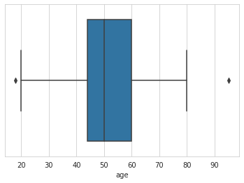

	Dato que también podemos comprobar con un histograma. Los valores más elevados corresponden con el promedio y los más pequeños con los valores atípicos que muestra el diagrama de caja.

	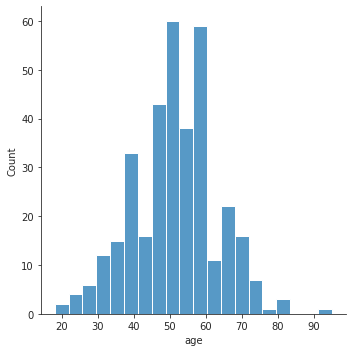

**Variables categóricas**

- Moda de algunas de las variables

  ```
  region   sex  alcohol  tobacco  khat  pain_swallowing  weight_loss
  OROMIA   0.0      1.0      1.0   1.0              1.0          1.0
  ```
  ```   

   cough  status_patient  
     1.0             1.0  

  ```

  Interpretación:

  - La mayoría de casos se encuentran en OROMIA.
  - La mayoría de casos son del genero '0'.
  - La mayoría de casos toman alcohol.
  - La mayoría de casos fuman tabaco.
  - La mayoría de casos fuman khat.
  - La mayoría de casos tienen dolor al tragar.
  - La mayoría de casos perdieron peso.

- Tabla de contingencia (causas)

   ```
   khat            0            1             total
   alcohol         0     1      0      1           
   tobacco         0  1  0   1  0   1  0    1      
   status_patient                                  
   0               0  0  0  10  1   4  0   24    39
   1               6  6  4  66  8  37  3  180   310
   total           6  6  4  76  9  41  3  204   349
   ```

   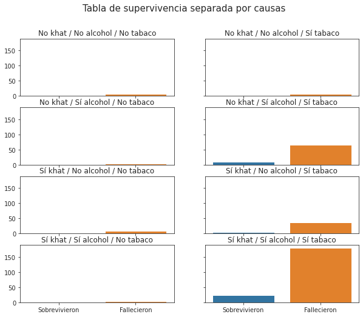

   Algunas interpretaciones:

   - 204 personas tomaban alcohol y fumaban tanto tabaco como khat de las cuales sobrevivieron 24 y fallecieron 180.
   - 76 personas tomaban alcohol y fumaban tabaco pero no khat de las cuales sobrevivieron 10 y fallecieron 66.
   - 6 personas no tomaban alcohol y no fumaban ni tabaco ni khat de las cuales fallecieron todas.

- Tabla de contingencia (síntomas)

   ```
   pain_swallowing  0          1              total
   cough            0   1      0       1           
   weight_loss      0   0  1   0  1    0    1      
   status_patient                                  
   0                1   2  1   1  0    9   25    39
   1                1   8  6  11  6  109  169   310
   total            2  10  7  12  6  118  194   349
   ```

   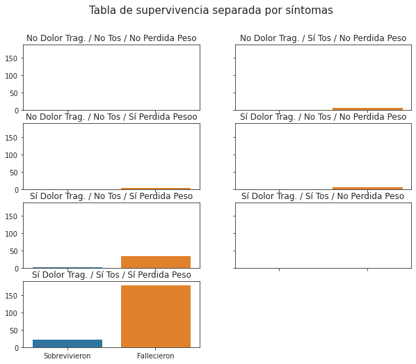

   Algunas interpretaciones:

   - 118 personas tuvieron dolor al tragar y tos pero no perdieron peso, de las cuales sobrevivieron 9 y fallecieron 109.
   - 194 personas tuvieron dolor al tragar, todos y perdida de peso, de las cuales sobrevivieron 25 y fallecieron 169.
   - 12 personas tuvieron dolor al tragar, no tuvieron tos ni perdida de peso, de las cuales sobrevivió 1 y fallecieron 11,

- Tabla de contingencia (tratamiento)

   ```
   chemotherapy      0              1           total
   radiotherapy      0       1      0      1         
   surgery           0    1  0  1   0   1  0  1      
   status_patient                                    
   0                 2   17  1  1  10   4  2  2    39
   1               109  120  6  4  46  15  7  3   310
   total           111  137  7  5  56  19  9  5   349
   ```

   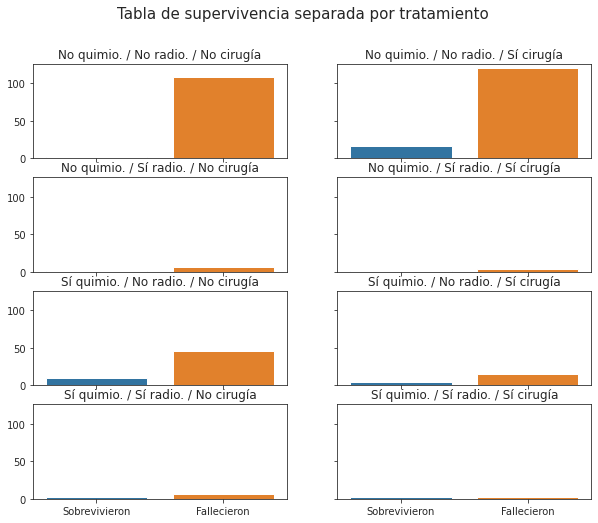


   Algunas interpretaciones:

   - 56 personas fueron tratadas con quimiterapia sin radioterapia ni cirugía de las cuales 10 sobrevivieron y 46 murieron.
   - 137 personas fueron operadas, no tuvieron quimiterapia ni radioterapia, de las cuales 17 sobrevivieron y 120 murieron.
   - 111 personas no recibieron ningún tratamiento, de las cuales 2 sobrevivieron y 109 murieron.

</p>
</details>

Al finalizar esta etapa, se pudo apreciar que el conjunto de datos podría no ser útil para detectar patrones de supervivencia pero sí de fallecimiento.

---

### :ballot_box_with_check: Clasificación

A continuación se muestran algunas técnicas de predicción basadas en clasificación.

Para realizar el entrenamiento con todos los modelos se siguieron los siguientes pasos:

1. Como datos de entrada se eligieron todos los campos menos la llave primaria, la región y por supuesto la columna que nos indica el estado del paciente.

1. Como dato de salida se eligió únicamente el estado del paciente.

1. Separar el conjunto de datos en entrenamiento y prueba (70%/30%).

1. Realizar el entrenamiento.

Para analizar los resultados se usó una matriz de confusión.

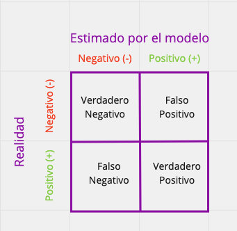

Una interpretación de los resultados de esta matriz, se puede dar mediante las siguientes fórmulas:

1. Precisión: De todas las clasificaciones positivas que hicimos, ¿cuántas de ésas eran en realidad positivas?
   
   *precision = VP / (VP + FP)*

1. Exactitud: Del total de clasificaciones que hicimos, ¿cuántas fueron clasificadas correctamente?
   
   *exactitud = (VP + VN) / (VP + FN + FP + VN)*

1. Sensibilidad: De todas las clasificaciones positivas que había en realidad, ¿cuántas fueron clasificadas correctamente como positivas?
   
   *sensibilidad = VP / (VP + FN)*

1. Especificidad: De todas las clasificaciones negativas que había en realidad, ¿cuántas fueron clasificadas correctamente como negativas?
   
   *especificidad = VN / (VN + FP)*


Adicionalmente se aplicó PCA para reducir el número de columnas. Con este paso se pretende comparar si todos los modelos definidos tienen alguna mejora. En este caso, ninguno de los modelos presentó una mejora considerable por lo que no se muestan en este documento, sin embargo pueden observarse en el *notebook* de cada modelo. Los resultados de PCA se guardaron en un archivo CSV ([_**notebook**_](notebooks/pca.ipynb)).

El número de componentes se elegió estableciente la varianza de las componentes. En este caso se usó una varianza del 95%. Como referencia se consultó [esta referencia](https://www.mikulskibartosz.name/pca-how-to-choose-the-number-of-components/).

<br/>

<u>**Regresión Lineal**</u>

Se inició este proyecto con la idea de encontrar alguna correlación entre las distintas variables. Sin embargo al sólo contar con una variable cuantitativa, de descartó el uso de una regresión lineal. Esto se puede corroborar con la siguiente gráfica de pares.

<details><summary><strong>Gráfica de pares (<em><a href="notebooks/regresion.ipynb">notebook</a>)</em></strong> </summary>
	<p>

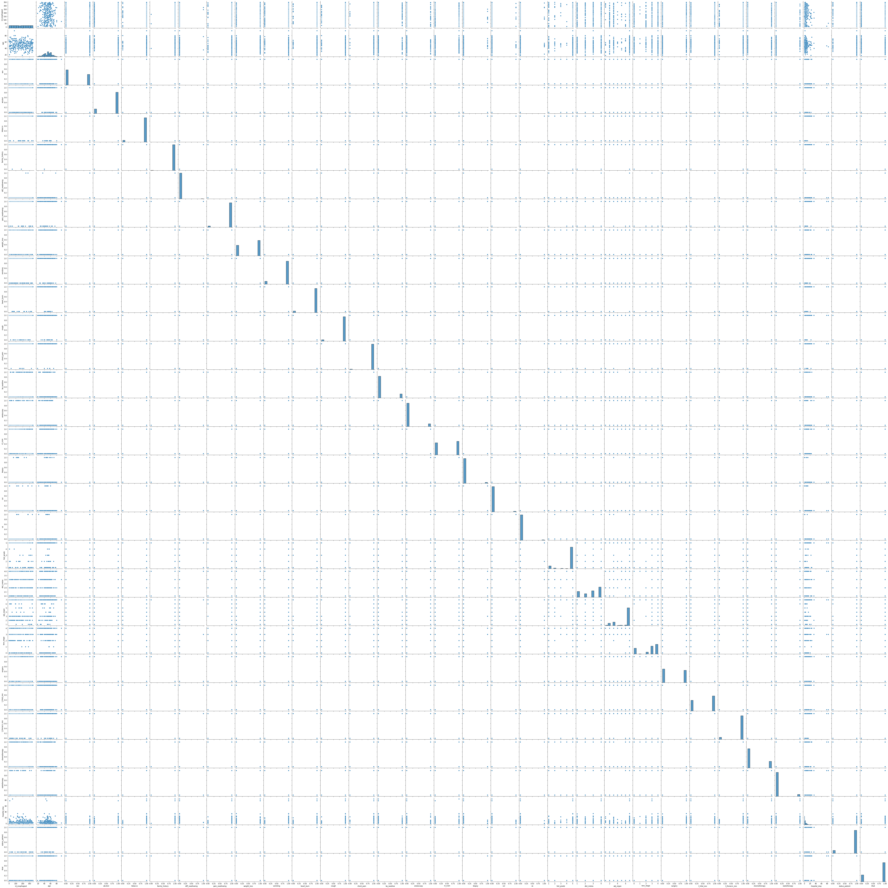

</p>
</details>
<br/>

<u>**Clasificación Supervisada**</u>

Podemos usar los datos para *predecir* si un paciente puede o no sobrevivir usando un método de Clasificación Binaria Supervisada dado que sólo tenemos dos posibles valores. Se optó por emplear tres técnicas de clasificación.

<details><summary><strong>Regresión logística (<em><a href="notebooks/logistica.ipynb">notebook</a>)</em></strong> </summary>
	<p>

Podemos usar regresión logística en este caso la cuál modela el problema por medio del *sigmoidal* que permite dejar los valores en cero de un lado y los de uno en el otro:

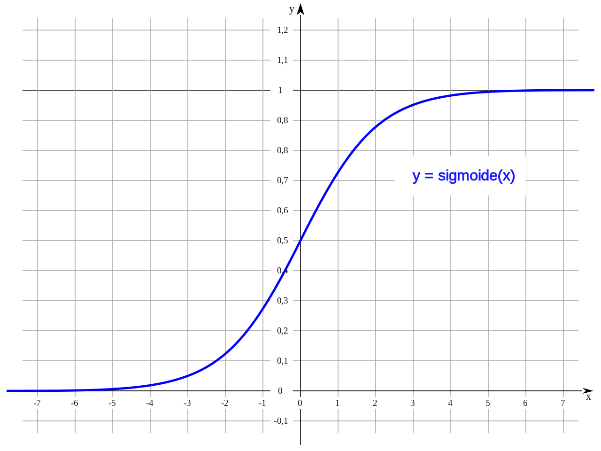

Para el modelo generado se obtuvo la siguiente matriz:


Interpretación:

```
Precision: 0.941747572815534
Exactitud: 0.9428571428571428
Sensibilidad: 1.0
Especificidad: 0.25
```

Lo cual nos dice que la precisión, exactitud y sensibilidad es bastante buena. Sin embargo la especificad es muy baja lo cual indica que hubo muchos datos que fueron incorrectamente clasificados como negativos. Dicho de otra forma, el modelo fue bueno para clasificar fallecimientos pero no tanto para sobrevivientes. Esto se debe quizá a que tenemos más datos de fallecimientos.

</p>
</details>

<details><summary><strong>Árboles de Decisión (<em><a href="notebooks/random_forest.ipynb">notebook</a>)</em></strong> </summary>
<p>

La idea detrás de un árbol de decisión consiste en ir tomando decisiones de forma encadenada e ir descartando soluciones hasta quedarnos con una sola salida, en este caso el valor de la variable `status_patient`. De esta forma el método llamado *random forest*, consiste en tomar varios árboles (bosque) con las siguientes características:

1. Cada árbol de decisión debe ser independiente.
1. Cada árbol debe ser entrenado aleatoriamente,
1. La información que reciben los árboles debe ser distinta para que se basen en distintas características.

Una vez que todos los árboles se han entrenado, se hace un *consenso* para decidir el resultado de una predicción. Cada uno de los árboles *vota* y la clase más votada es la que define a qué clase pertenece el dato.

En este caso se hizo el mismo proceso que con la regresión logística: se separo el conjunto en entrenamiento y prueba, se entrenó y se midió el desempeño usando una matriz de confusión y las fórmulas para interpretar los resultados.

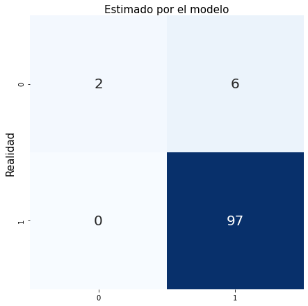

```
Precision: 0.9320388349514563
Exactitud: 0.9238095238095239
Sensibilidad: 0.9896907216494846
Especificidad: 0.125
```

Donde vemos que nuevamente la especificidad es bastante baja.

Cada uno de los árboles tiene una forma similar a la siguiente. Se muestra en el ejemplo el árbol 18 del bosque.

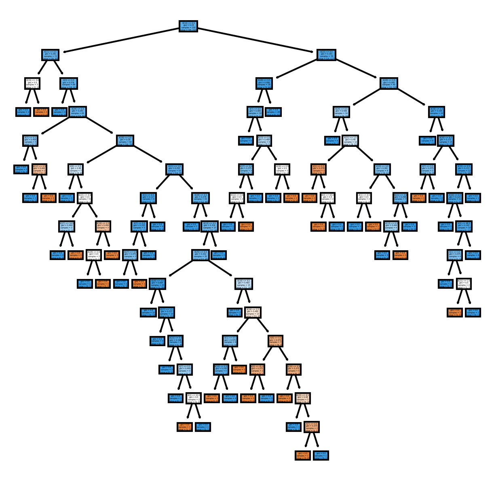

</p>
</details>

<details><summary><strong>Naïve Bayes (<em><a href="notebooks/naive_bayes.ipynb">notebook</a>)</em></strong> </summary>
<p>	

Este clasificador se basa en la noción de las características de un objeto que contribuyen a su categorización. Se muestran de la misma manera su matriz de confusión y métricas.

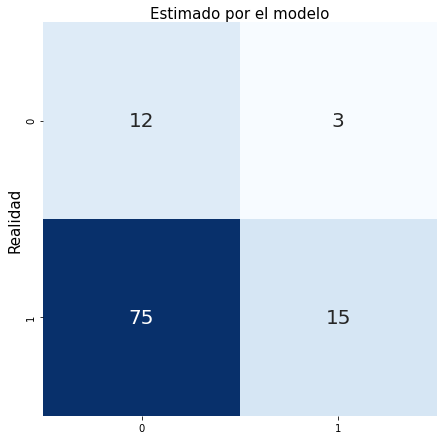

Interpretación:

```
Precision: 0.8333333333333334
Exactitud: 0.2571428571428571
Sensibilidad: 0.16666666666666666
Especificidad: 0.8
```

En este caso aunque mejoró considerablemente la especificidad, la exactitud y sensibilidad bajaron demasiado.

</p>
</details>
<br/>

<u>**Clasificación No Supervisada**</u>

Podemos usar la clasificación No Supervisada como una alternativa que permita clasificar los casos correctamente mediante clusterización, de forma tal que si el modelo genera correctamente las clases, podemos usar el modelo como predictor. En esta caso usamos los datos originales para comparar con la salida de nuestro modelo. Para este caso se obtó por usar *K-Means*.

<details><summary><strong>K-Means (<em><a href="notebooks/kmeans.ipynb">notebook</a>)</em></strong> </summary>
<p>	

Este algoritmo muy útil cuando tenemos un dataset que queremos dividir por grupos pero no sabemos exactamente qué grupos queremos y cuáles son sus características. Lo único que tenemos que decidir de antemano es cuántos grupos queremos, y el algoritmo intentará agrupar nuestros datos en esa cantidad de grupos.

Se obtuvo la siguiente matriz:

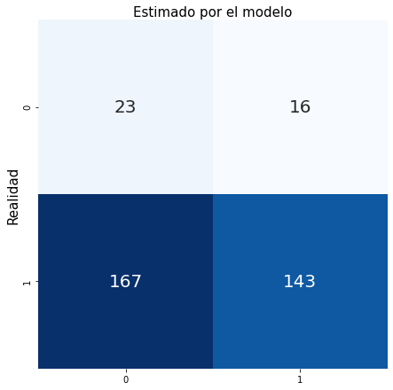

Interpretación:

```
Precision: 0.89937106918239
Exactitud: 0.47564469914040114
Sensibilidad: 0.4612903225806452
Especificidad: 0.5897435897435898
```

Notamos como de todos nuestros modelos fue el peor evaluado.

</p>
</details>

---

### :ballot_box_with_check: Conclusiones

Con base en los distintos trabajos de análisis y definición de modelos se dan las siguientes conclusiones:

- Los conjuntos de datos originales no son iguales entre sí, por lo que se deben analizar por separado al tener columnas distintas. Motivo por el cuál sólo se hizo el análisis sobre casos de Cáncer de Esófago.

- La edad promedio de personas con cáncer de esófago ronda los 50 años (para esta muestra).

- Hay algunos casos *raros* con pacientes de 18 y 95 años.

- En su mayoría los casos se encontraron en OROMIA, las posibles causas se deben a que los pacientes toman alcohol y fuman. En su mayoría tuvieron síntomas como tos, dolor al tragar y pérdida de peso.

- No es posible hacer una regresión lineal dado que la mayoría de datos son categóricos.

- Los mejores modelos de predicción fueron la regresión logística y los árboles de decisión con diferencias mínimas.

- No se sugiere usar el conjunto de datos para detectar si el paciente vivirá, esto se puede apreciar con el cálculo de la especificidad en todos los modelos que se definieron. En todos los casos fue bajo, lo cual nos indica que los datos fueron incorrectamente clasificados como negativos en su mayoría.

---

### :ballot_box_with_check: Trabajo a futuro

- Limpiar e integrar todos los conjuntos de datos.

- Recabar información sobre las categorías incluidas en los conjuntos de datos pues algunos datos son desconocidos tales como el género (¿qué significa 0 y qué 1?).

- Replicar el proceso para los datos de cáncer colorectal y de próstata. Es probable que con estos conjuntos de datos sí sea posible determinar si el paciente vivirá. 

- Recabar nuevos datos para detectar otros tipos de cancer, integrando en este caso algunos datos cuantitativos además de la edad.
